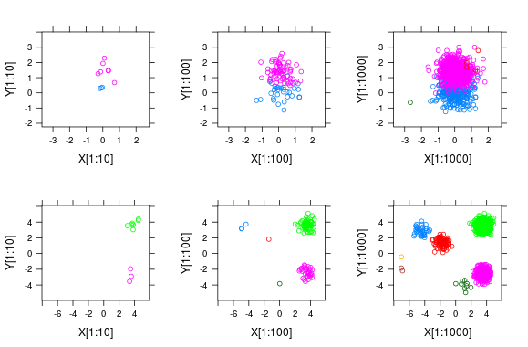

Dirichlet Mixture Model
=======================

The `tweetopic.DMM` class provides utilities for fitting and using
Dirichlet Mixture Models.

*Simulation of 1000 observations drawn from a DMM*
`source: Wikipedia <https://en.wikipedia.org/wiki/Dirichlet_process#/media/File:DP_clustering_simulation.png>`_

The Dirichlet Mixture Model or DMM is a generative probabilistic model,
that assumes that all data points in the population are generated from
a mixture of dirichlet distributions with unknown parameters.

DMMs can be thought of as a fuzzy clustering method, but can also be employed as topic models.
It has been demonstrated that DMMs work particularly well for topic modelling over short texts (Yin and Wang, 2014). 

.. image:: _static/plate_notation.png
    :width: 400
    :alt: Graphical model with plate notation

*Graphical model of DMM with plate notation (Yin & Wang, 2014)*

Usage
^^^^^^^

Creating a model:

.. code-block:: python

    from tweetopic import DMM

    dmm = DMM(
        n_components=15,
        n_iterations=200,
        alpha=0.1,
        beta=0.2,
    )

Fitting the model on a document-term matrix:

.. code-block:: python

    dmm.fit(doc_term_matrix)

Predicting cluster labels for unseen documents:

.. code-block:: python

    dmm.transform(new_docs)

:ref:`API reference <tweetopic dmm>`

References
^^^^^^^^^^
`Yin, J., & Wang, J. (2014). A Dirichlet Multinomial Mixture Model-Based Approach for Short Text Clustering.  <https://www.researchgate.net/publication/266660462_A_Dirichlet_multinomial_mixture_model-based_approach_for_short_text_clustering>`_ *In Proceedings of the 20th ACM SIGKDD International Conference on Knowledge Discovery and Data Mining (pp. 233–242). Association for Computing Machinery.*
