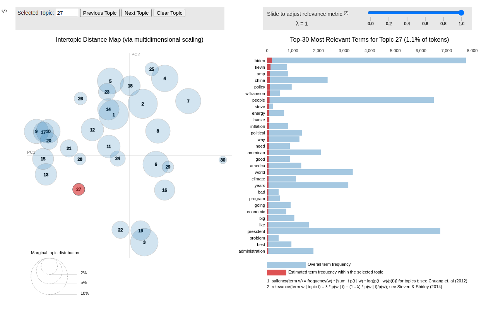

Topic Pipelines
================

A topic pipeline provides a concise way of text vectorization, topic modelling,
and visual inspection of topic models.

Create a vectorizer and topic model:

.. code-block:: python

    from tweetopic import DMM
    from sklearn.feature_extraction.text import CountVectorizer

    vectorizer = CountVectorizer(
        stop_words="english",
        max_df=0.3,
        min_df=15,
    )
    dmm = DMM(
        n_components=15,
        n_iterations=200,
        alpha=0.1,
        beta=0.2,
    )

.. note::
    Topic pipelines in tweetopic also support LatentDirichletAllocation and NMF from sklearn.
    If DMM doesn't suit your purposes, your still free to use the convenience of topic pipelines.

Add the two components to a tweetopic pipeline:

.. code-block:: python

    from tweetopic import TopicPipeline

    pipeline = TopicPipeline(vectorizer, dmm)

Fit pipelines on a stream of texts:

.. code-block:: python

    pipeline.fit(texts)

Inspect topics by looking at the top words in each topic:

.. code-block:: python
    
    pipeline.top_words(top_n=3)

.. code-block:: python

    [
        {'vaccine': 1011.0, 'coronavirus': 428.0, 'vaccines': 396.0},
        {'afghanistan': 586.0, 'taliban': 509.0, 'says': 464.0},
        {'man': 362.0, 'prison': 310.0, 'year': 288.0},
        {'police': 567.0, 'floyd': 444.0, 'trial': 393.0},
        {'media': 331.0, 'twitter': 321.0, 'facebook': 306.0},
        ...
        {'pandemic': 432.0, 'year': 427.0, 'new': 422.0},
        {'election': 759.0, 'trump': 573.0, 'republican': 527.0},
        {'women': 91.0, 'heard': 84.0, 'depp': 76.0}
    ]

or use rich visualizations with PyLDAvis:

.. code-block:: python
    
    pipeline.visualize(texts)

.. note::
    PyLDAvis has to be installed for you to be able to use this, please
    install optional dependencies.

:ref:`API reference <tweetopic pipeline>`
